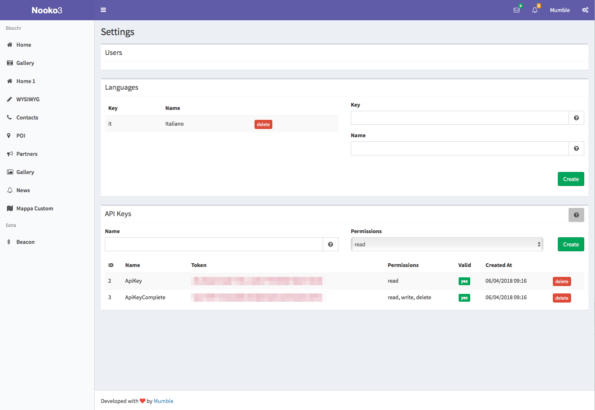

<p align="center" >

</p>

# NoookoSDK
<p><a class="no-attachment-icon" href="/blob/docs/badge.svg" target="_blank"></a></p>


NookoSDK is a client libary, written in Objective-C, that can be used to interact with the [Nooko](https://nooko2.mumbleserver.it/login) API. The minimum deplaoyment target for the library is iOS 10.0.
> Even this is a library written in Objective-C it can be integrated and used also in Swift projects. The example code below will be in both languages.

# Installation

# Installation with CocoaPods

CocoaPods is a dependency manager for iOS, which automates and simplifies the process of using 3rd-party libraries in your projects. You can install CocoaPods with the following command:

```
$ gem install cocoapods
```

To integrate the NookoSDK into your Xcode project using CocoaPods, specify it in your Podfile:

```
platform :ios, '10.0'

target 'TargetName' do
    pod 'NookoSDK', git: 'https://github.com/Mumble-SRL/NookoSDK-Objc.git'
end
```

If you use Swift rememember to add `use_frameworks!` before the pod declaration.


Then, run the following command:

```
$ pod install
```

CocoaPods is the preferred methot to install the library.

# Manual installation

To install the library manually drag and drop the folder `NookoSDK` to your project structure in XCode. 

Note that `NookoSDK` has `AFNetworking (3.0)` as a dependency, so you have to install also this library.

# Initialization

To initialize the SDK you have to create a token through the [dashboard](https://nooko2.mumbleserver.it/). Click on the settings icon on the top-right and create a API Key specifiyng the permissions.



In your `AppDelegate` `application:didFinishLaunchingWithOptions:` initialize the SDK like the following:
q
**Objective-c**:

```
#import "AppDelegate.h"
#import "NookoSDK.h"

@interface AppDelegate ()

@end

@implementation AppDelegate


- (BOOL)application:(UIApplication *)application didFinishLaunchingWithOptions:(NSDictionary *)launchOptions {
    
    [NKManager sharedManager].apiToken = @"YOUR_API_TOKEN";
    
    return YES;
}
```

**Swift**:

```
import NookoSDK

...

func application(_ application: UIApplication, didFinishLaunchingWithOptions launchOptions: [UIApplicationLaunchOptionsKey: Any]?) -> Bool {
        NKManager.shared().apiToken = "YOUR_API_TOKEN"
    return true
}
```

You will not be able to interact with the SDK if you don't initialize it with a correct token/key.

# Usage

All the interactions with the SDK will be trought the `NKManager` singleton class. All the api calls have a plurarl/singular version so for example you can retrieve the list of blocks of the project or you can retrieve a single block giving its id.

# Project

You can retrieve the informations of the project like this:

**Objective-C**:


```
[[NKManager sharedManager] getProjectWithSuccess:^(NKProject *project) {
        
} Failure:^(NSError *error) {
	NSLog(@"There was an error: %@", error.localizedDescription);
}];
```

**Swift**:

```
NKManager.shared().getProjectWithSuccess({ (project) in
            
    }) {(error) in
            
}
```


# Blocks

You can retrieve the blocks of the project with the function `getBlocksWithParameters:Success:Failure` like this:

**Objective-C**:

```
[[NKManager sharedManager] getBlocksWithParameters:nil Success:^(NSArray<NKBlock *> *blocks, NKPaginationInfo *pagintaionInfo) {
     
} Failure:^(NSError *error) {
        
}];
```

**Swift**:

```
NKManager.shared().getBlocksWith(nil, success: { (blocks, paginationInfos) in
            
}) { (error) in
            
}
```

The parameter `parameters` is an optional array of objects that conforms to the `NKParameter` protocol passed to the nooko api as parameter. The majorityof the parameters that can be passed to the apis are already defined in the SDK and can be used after the initialization:

* `NKSortParameter`
* `NKPaginationParameter`
* `NKFilterParameter`
* `NKGeofenceParameter`

If you want to pass another type of parameter you can use the `NKGeneralParameter` class that can be initialized with a key and a value that will be passed to the apis.

So if you want to include a pagination parameter you can do like this:

**Objective-C**:

```
NKPaginationParameter *paginationParam = [[NKPaginationParameter alloc] initWithSkip:0 Take:10];
[[NKManager sharedManager] getBlocksWithParameters:@[paginationParam] Success:^(NSArray<NKBlock *> *blocks, NKPaginationInfo *pagintaionInfo) {
        
} Failure:^(NSError *error) {
        
}];
```

**Swift**:

```
let paginationParam = NKPaginationParameter(skip: 0, take: 10)
NKManager.shared().getBlocksWith([paginationParam], success: { (blocks, paginationInfos) in
            
}) { (error) in
            
}
```

There are two other versions of the `getBlocksWithParameters:Success:Failure`, one that take an adiitional parameter `includingSections` (a boolean that indicate whether or not include, for each block, the sections), and another that takes `includingSections` and `includeElements` (a boolean value that do the same thing but for the elements of the sections).

So you could retrieve the informations of all the blocks, all the sections of the blocks and all the elements of the sections with this call:

**Objective-C**:

```
[[NKManager sharedManager] getBlocksWithParameters:nil IncludingSections:TRUE AndElements: TRUE Success:^(NSArray<NKBlock *> *blocks, NKPaginationInfo *pagintaionInfo) {
        
} Failure:^(NSError *error) {

}];
```

**Swift**:

```
NKManager.shared().getBlocksWith(nil, includingSections: true, andElements: true, success: { (blocks, paginationInfos) in
            
}) { (error) in
            
}
```

# Sections

You can retrieve all the sections with a block with the given id with the function `getBlocksWithParameters:Success:Failure` like this:

**Objective-C**:

```
[[NKManager sharedManager] getSectionsWithBlockId:THE_BLOCK_ID Parameters:nil Success:^(NSArray<NKSection *> *sections, NKPaginationInfo *pagintaionInfo) {
        
} Failure:^(NSError *error) {
        
}];
```

**Swift**:

```
NKManager.shared().getSectionsWithBlockId(THE_BLOCK_ID, parameters: nil, success: { (sections, paginationInfos) in
            
}) { (error) in
            
} 
```

Like for the blocks there's a version of this function that takes a bool `includeElements` that indicate to include or not the elements of the section se if you want to retrieve all the sections of a block and their elements you can call:

**Objective-C**:

```
[[NKManager sharedManager] getSectionsWithBlockId:THE_BLOCK_ID IncludeElement:TRUE Parameters:nil Success:^(NSArray<NKSection *> *sections, NKPaginationInfo *pagintaionInfo) {
        
} Failure:^(NSError *error) {
        
}];
```

**Swift**:

```
NKManager.shared().getSectionsWithBlockId(THE_BLOCK_ID, parameters: nil, includeElements: true, success: { (sections, paginationInfos) in
            
}) { (error) in
            
}
```

# Object mapping

The `NKSection` class has a commodity function that can be used to map the elements of the section to a custom object created by you. For Exaple if you have a `News` object like this

```
#import <Foundation/Foundation.h>

@interface News : NSObject

@property NSString *title;
@property NSString *content;
@property NSURL *imageUrl;
@property NSString *link;

@end
```

And a block in Nooko that represent a newsfeed you could create and populate an array of news object like this:

```
NSInteger newsBlockId = 12;
NSDictionary *mappingDictionary = @{@"title" : @"title",
                                    @"content" : @"content",
                                    @"image.firstImage.url" : @"imageUrl",
                                    @"link" : @"link"};
NSMutableArray *newsArray = [[NSMutableArray alloc] init];
[[NKManager sharedManager] getBlockWithBlockId:newsBlockId Parameters:nil IncludingSections:YES AndElements:YES Success:^(NKBlock *block) {
   NSMutableArray *newsArray = [[NSMutableArray alloc] init];
   for (NKSection *section in block.sections){
        News *n = [[News alloc] init];
        [section mapElementsToObject:n withMapping:mappingDictionary];
        [newsArray addObject:n];
    }
 } Failure:^(NSError *error) {
    [self showError:error];
 }];
```

As you can see in the example you can point to the property of the object using the dot notation. If it's not defined any property the SDK will use the value of the element object (calling the value function).

You can find a complete example in the Example project.

# Serialization

All the model objects implement the `NSCoding` and `NSSecureCoding` protocol so you can serialize and deserialize them without having to implement it. Below the list of objects that implement those protocols

* `NKProject`
* `NKBlock`
* `NKSection`
* `NKElement`
* `NKTextElement`
* `NKImagesElement`
* `NKImage`
* `NKMediaElement`
* `NKFile`
* `NKCheckboxElement`
* `NKWysiwygElement`
* `NKDateElement`
* `NKAddressElement`
* `NKDropdownElement`
* `NKPollElement`
* `NKGeneralElement`
* `NKUser`

# Equality

All the model objects implement the `isEqual:` function based on the corresponding id. So for example an NKSection will result equal to another NKSection object if they have the same `sectionId`.


# Documentation

For further information, you can check out the full SDK Reference in the [docs](https://github.com/Mumble-SRL/NookoSDK-Objc.git/tree/master/docs) folder.


# Contacts

You can contuct us at [info@mumbleideas.it](mailto:info@mumbleideas.it).

# License

NookoSDK is released under the MIT license. See [LICENSE](https://raw.githubusercontent.com/Mumble-SRL/NookoSDK-Objc/master/LICENSE) for details.
